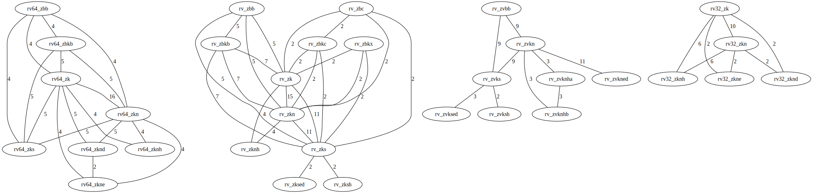
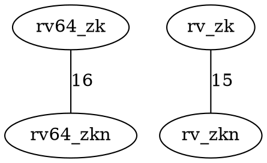

# Results

## Sample Text Report

The full checked-in sample report is available here:

- [sample_output.txt on GitHub](https://github.com/Prtm2110/riscv-isa-explorer/blob/master/artifacts/sample_output.txt)

Current Tier 2 summary from the sample report:

```text
Tier 2 Cross Reference
60 direct matches
14 JSON-only extension names
4 JSON internal or privilege-style tags
58 manual-only extension names
45 manual umbrella, profile, or privileged names
```

## Sample Graph Artifact

The checked-in graph files are available here:

- [sample_graph.dot on GitHub](https://github.com/Prtm2110/riscv-isa-explorer/blob/master/artifacts/sample_graph.dot)
- [sample_graph.svg on GitHub](https://github.com/Prtm2110/riscv-isa-explorer/blob/master/artifacts/sample_graph.svg)

## Embedded Graph

{ .graph-image }

Each edge connects two extension tags that share at least one instruction.
The edge label is the number of shared instructions.

## DOT Excerpt



## Notes

The sample report separates direct extension-name mismatches from internal JSON tags and manual umbrella, profile, or privileged names, so the Tier 2 output is easier to review.
