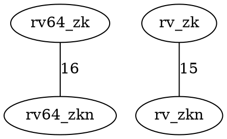

# Results

## Sample Text Report

The full checked-in sample report is available here:

- [sample_output.txt on GitHub](https://github.com/Prtm2110/Geometric/blob/master/sample_output.txt)

Short excerpt:

```text
Tier 1 Summary
rv32_c | 1 instructions | e.g. C.JAL
rv32_c_f | 4 instructions | e.g. C.FLW
rv32_d_zfa | 2 instructions | e.g. FMVH.X.D
...
Tier 2 Cross Reference
59 matched, 19 in JSON only, 103 in manual only
```

## Sample Graph Artifact

The checked-in DOT graph is available here:

- [sample_graph.dot on GitHub](https://github.com/Prtm2110/Geometric/blob/master/sample_graph.dot)

Short excerpt:



## What The Graph Shows

Each edge connects two extension tags that share at least one instruction.
The edge label is the number of shared instructions.
